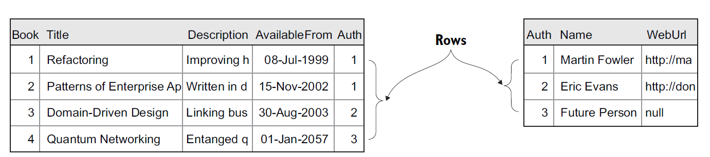
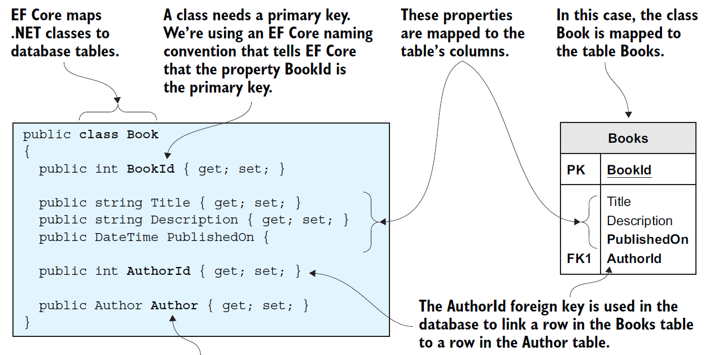
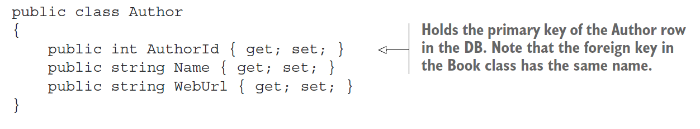

You can use EF Core as an O/RM that maps between the relational database and the
.NET world of classes and software code.

***EF Core mapping between a database and .NET software***

| Relational Database                 | .NET Software                                      |
| ----------------------------------- | -------------------------------------------------- |
| Table                               | .NET class                                         |
| Table Columns                       | Class Properties/Fields                            |
| Rows                                | Elements in .NET Collections  for instance , List |
| Primay keys: unique Row             | A unique class instance                            |
| Foregin keys: define a relationship | Reference to antoher class                         |
| SQL for instance, WHERE             | .NET LINQ for instance, Where (p => ....)          |

For this MyFirstEfCoreApp application example, I created a simple database, shown in
figure  with only two tables:

1. A Books table holding the book informatio
2. An Author table holding the author of each book

ADVANCED NOTE In this example, I let EF Core name the tables using its default configuration settings. The Books table name comes from the DbSet `<Book>`

Books property  . The Author table name hasn’t got a DbSet `<T>` property, so EF Core uses the name of the class.

### The classes that map to the database: Book and Author

EF Core maps classes to database tables. Therefore, you need to create a class that will define the database table or match a database table if you already have a database

The Author property is an EF Core navigational property. EF Core uses this on a save to see whether the Book has an Author class attached. If so, it sets the foreign key, AuthorId. Upon loading a Book class, the method Include will fill this property with the Author class that's linked to this Book class by using the foreign key, AuthorId.

I ll be using: Author. This class has the same structure as the Book class  with a primary key that follows the EF Core naming
conventions of `<ClassName>`Id . The Book class also has a navigational property of type Author and an int type property called AuthorId that matches the Author’s primary key. These two properties tell EF Core that you want a link from  the Book class to the Author class and that the AuthorId property should be used as the foreign key to link the two tables in the database.

### The application's DbContext

The other important part of the application is DbContext, a class you create that inherits from EF Core’s DbContext class. This class holds the information EF Core needs to configure that database mapping and is also the class you use in your code to
access the database
