Intall From Nuget Package

Microsoft.EntityFrameworkCore

Microsoft.EntityFrameworkCore.Design

Microsoft.EntityFrameworkCore.Tools

Microsoft.EntityFrameworkCore.SqlServer

**Overview of EF Core**

You can use EF Core as an O/RM that maps between the relational database and the .NET world of classes and software code.

| Relational database                 | .NET software                                    |
| ----------------------------------- | ------------------------------------------------ |
| Table                               | .NET class                                       |
| Table columns                       | Class properties/fields                          |
| Rows                                | Elements in .NET collections—for instance, List |
| Primary keys: unique row            | A unique class instance                          |
| Foreign keys: define a relationship | Reference to another class                       |
| SQL—for instance, WHERE            | .NET LINQ—for instance, Where(p => …           |

Tables In Database

1. A Books table holding the book information
2. An Author table holding the author of each book

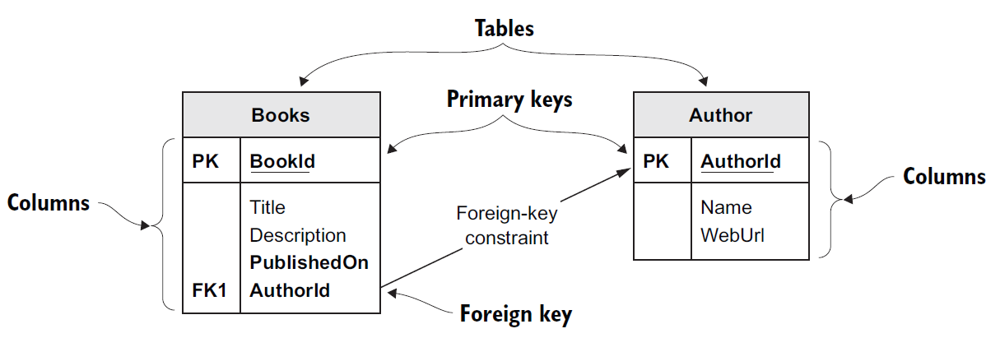

**Relational database with two tables: Books and Author**

The Books table name comes from the ****DbSet `<Book>` Books**** property.

 The Authors table name comes from the DbSet `<Author>` Author property.

### The classes that map to the database: Book and Author

EF Core maps classes to database tables. Therefore, you need to create a class that will define the database table or match a database table if you already have a database. Lots of rules and configurations exist

```csharp
using System;
using System.Collections.Generic;
using System.Linq;
using System.Text;
using System.Threading.Tasks;

namespace EFCoreSecondConsoleApp.Models
{
    public class Book
    {
        public int BookId { get; set; }
        public string Title { get; set; }
        public string Description { get; set; }
        public DateTime PublishedOn { get; set; }
        public int AuthorId { get; set; }
        public Author Author { get; set; }
    }
}

```

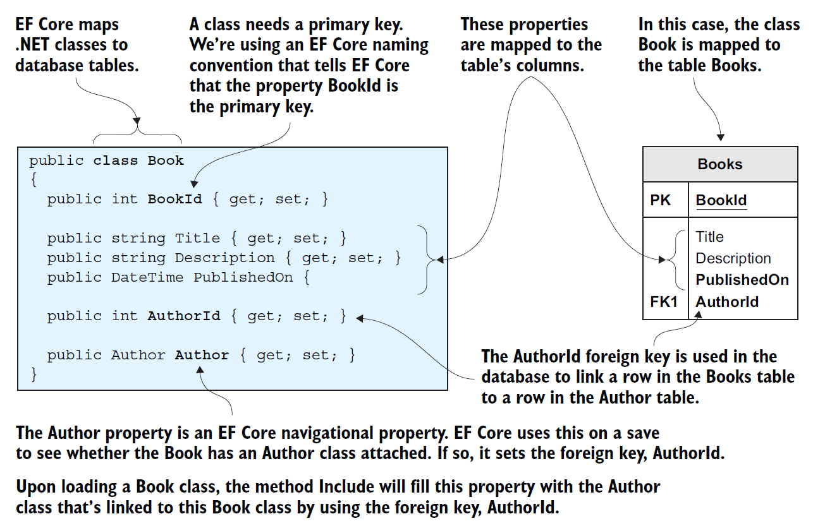

The.NET class Book, on the left, maps to a database table called Books, on the right. This is a typical way to build your application, with multiple classes that map to database tables.

This class has the same structure as the Book class with a primary key that follows the EF Core naming conventions of `<ClassName>`Id  example Book as primary key **BookId**

The Book class also has a navigational property of type Author and an int type property called AuthorId that matches
the Author's primary key. These two properties tell EF Core that you want a link from the Book class to the Author class and that the AuthorId property should be used as the foreign key to link the two tables in the database.

**The Author class**

```csharp
namespace EFCoreSecondConsoleApp.Models
{
    public class Author
    {
        public int AuthorId { get; set; }
        public string Name { get; set; }
        public string WebUrl { get; set; }

    }
}
```

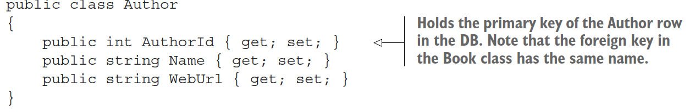

#### The application's DbContext

The other important part of the application is DbContext, a class you create that inherits from EF Core’s DbContext class. This class holds the information EF Core needs to configure that database mapping and is also the class you use in your code to
access the database

**You must have a class that inherits from the EF Core class DbContext. This class holds the information and configuration for accessing your database.**

```csharp
public class ApplicationDbContext : DbContext
{
private const string ConnectionString =
@"Server=(localdb)\mssqllocaldb;
Database=MyFirstEfCoreDb;
Trusted_Connection=True”;
protected override void OnConfiguring(
DbContextOptionsBuilder optionsBuilder)
{
optionsBuilder
.UseSqlServer(connectionString);
}
public DbSet<Book> Books { get; set; }
```

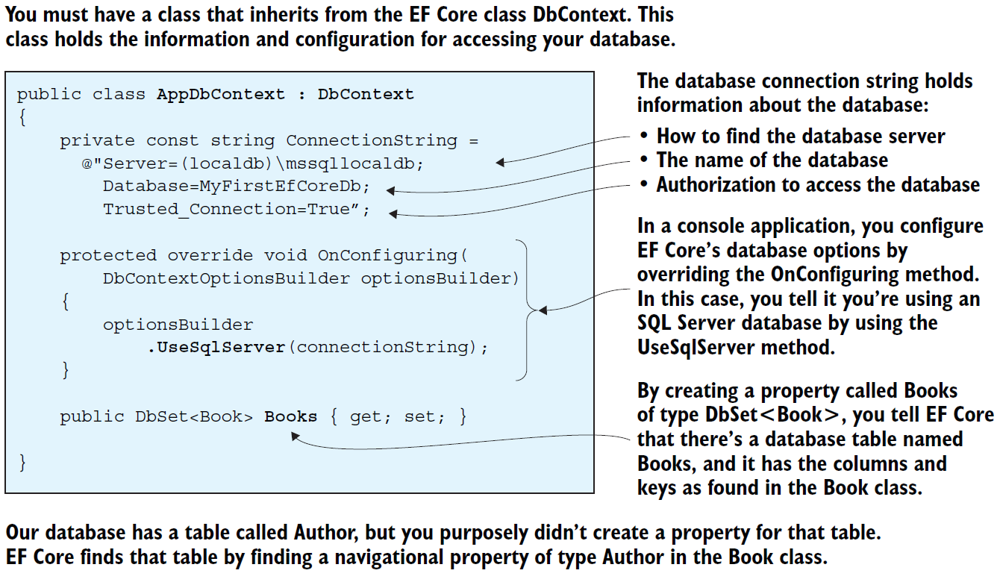

#### Modeling the database

Before you can do anything with the database, EF Core must go through a process that I refer to as modeling the database

This modeling is EF Core’s way of working out what the database looks like by looking at the classes and other EF Core configuration data. Then EF Core uses the resulting model in all database accesses. The modeling process is kicked off the first time you create the application's **DbContext**, in this case called **ApplicationDbContext**. It has one property, **DbSet** `<Book>`, which is the way that the code accesses the database

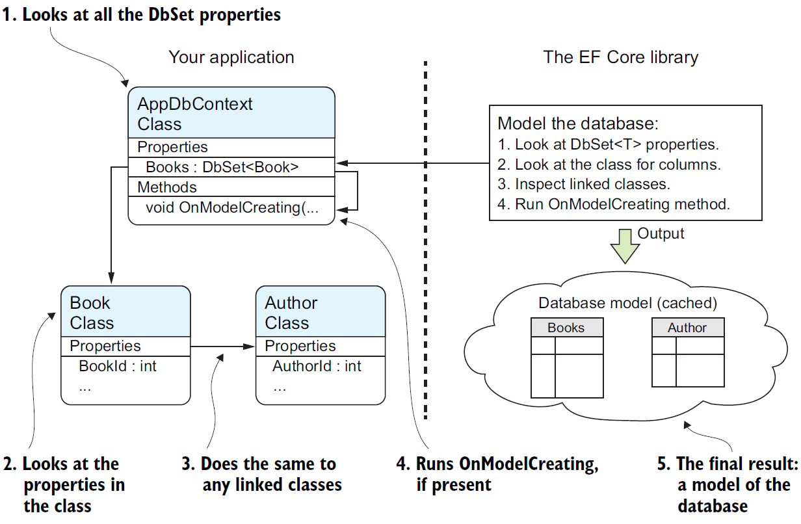

EF Core will create a model of the database your classes map to. First, it looks at the classes you have defined via the DbSet `<T>` properties; then it looks down all the references to other classes. Using these classes, EF Core can work out the default model of the database. But then it runs the OnModelCreating method in the application's DbContext, which you can override to add your specific commands to configure the database the way you want it.

the modeling steps that EF Core uses on our AppDbContext, which happens the first time you create an instance of the AppDbContext.

#### Reading data from the database

Reads All Books and Authors

```csharp
 using (var db = new ApplicationDbContext())
            {
                foreach (var book in
                db.Books.AsNoTracking()
                .Include(book => book.Author))
                {
                    var webUrl = book.Author.WebUrl == null
                    ? "- no web URL given -"
                    : book.Author.WebUrl;
                    Console.WriteLine(
                    $"{book.Title} by {book.Author.Name}");
                    Console.WriteLine(" " +
                    "Published on " +
                    $"{book.PublishedOn:dd-MMM-yyyy}" +
                    $". {webUrl}");
                }
            }
```

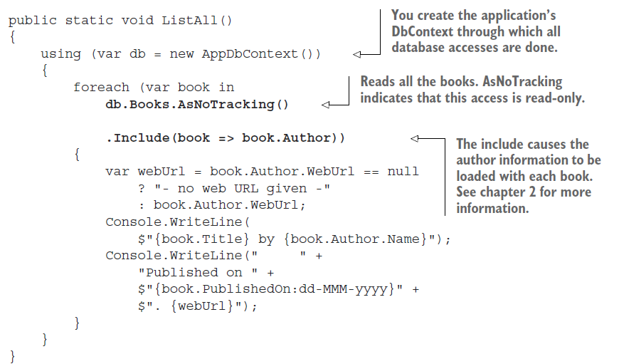

EF Core uses Microsoft’s .NET’s Language Integrated Query (LINQ) to carry the commands it wants done, and normal .NET classes to hold the data.

The query **db.Books.AsNoTracking().Include(book => book.Author)** accesses the *DbSet `<Book>`* property in the application's **DbContext** and adds a .Include
**(book => book.Author)** at the end to ask that the Author parts of the relationship are loaded too. This is converted by the database provider into an SQL command to access the database. The resulting SQL is cached to avoid the cost of retranslation if the same database access is used again

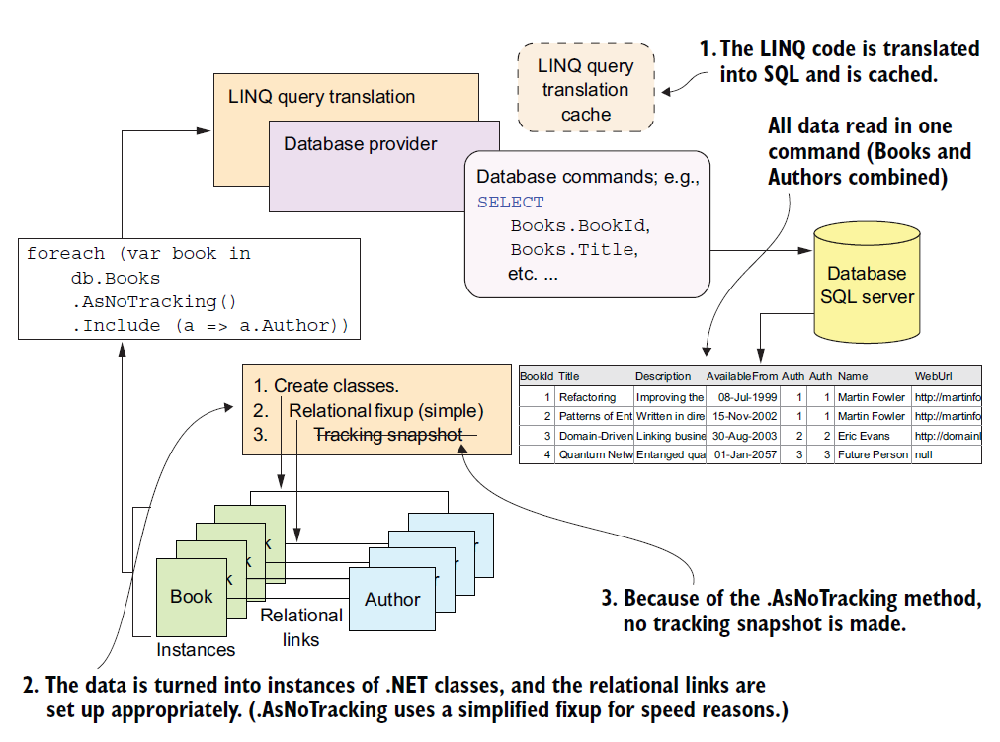

**SQL command produced to read Books and Author**

```csharp
SELECT [b].[BookId],
[b].[AuthorId],
[b].[Description],
[b].[PublishedOn],
[b].[Title],
[a].[AuthorId],
[a].[Name],
[a].[WebUrl]
FROM [Books] AS [b]
INNER JOIN [Author] AS [a] ON
[b].[AuthorId] = [a].[AuthorId]
```

**The code to update the author's WebUrl of the book Quantum Networking**

```csharp
 public static void ChangeWebUrl()
        {
            Console.Write("New Quantum Networking WebUrl > ");
            var newWebUrl = Console.ReadLine();
            using (var db = new ApplicationDbContext())
            {
                var singleBook = db.Books
                .Include(book => book.Author)
                .Single(book => book.Title == "Quantum Networking");
                singleBook.Author.WebUrl = newWebUrl;
                db.SaveChanges();
                Console.WriteLine("... SavedChanges called.");
            }
            ListAll();
        }
```

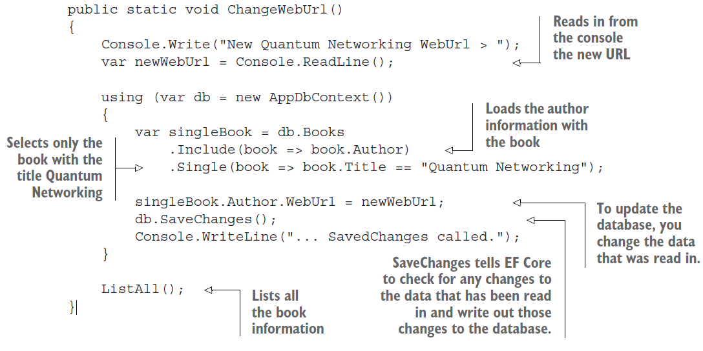

#### The execute command

EF Core can translate an expression tree into the correct commands for the database you’re using. In EF Core, a query is executed against the database when

1. It's enumerated by a foreach statement.
2. It's enumerated by a collection operation such as **ToArray, ToDictionary, ToList, ToListAsync**, and so forth.
3. LINQ operators such as First or Any are specified in the outermost part of the query

You'll use certain EF Core commands, such as Load, in the explicit loading of a relationship later in this chapter.

#### The two types of database queries

The other type of query is an **AsNoTracking** query, also known as a **read-only query**. This query has the EF Core’s **AsNoTracking** method added to the LINQ query.

As well as making the query **read-only**, the **AsNoTracking** method improves the performance of the query by turning off certain EF Core features.

```csharp
context.Books.AsNoTracking().Where(p => p.Title.StartsWith("Quantum")).ToList();
```

provides a detailed list of the differences between the normal, **read-write** query and the **AsNoTracking**, read-only query.

#### Eager loading: Loading relationships with the primary entity class

The first approach to loading related data is eager loading, which entails telling EF Core to load the relationship in the same query that loads the primary entity class. Eager loading is specified via two fluent methods, **Include and ThenInclude**. The next listing shows the loading of the first row of the Books table as an instance of the Book entity class and the eager loading of the single relationship, Reviews.

```csharp
var firstBook = context.Books
.Include(book => book.Reviews)
.FirstOrDefault();
```

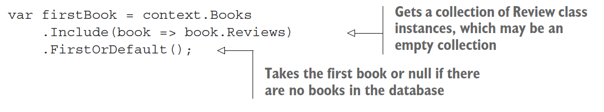

```csharp

SELECT "t"."BookId", "t"."Description", "t"."ImageUrl",
"t"."Price", "t"."PublishedOn", "t"."Publisher",
"t"."Title", "r"."ReviewId", "r"."BookId",
"r"."Comment", "r"."NumStars", "r"."VoterName"
FROM (
SELECT "b"."BookId", "b"."Description", "b"."ImageUrl",
"b"."Price", "b"."PublishedOn", "b"."Publisher", "b"."Title"
FROM "Books" AS "b"
LIMIT 1
) AS "t"
LEFT JOIN "Review" AS "r" ON "t"."BookId" = "r"."BookId"
ORDER BY "t"."BookId", "r"."ReviewId"
```

#### Eager loading of the Book class and all the related data

```csharp
var firstBook = context.Books
.Include(book => book.AuthorsLink)
.ThenInclude(bookAuthor => bookAuthor.Author)
.Include(book => book.Reviews)
.Include(book => book.Tags)
.Include(book => book.Promotion)
.FirstOrDefault();
```


The listing shows the use of the eager-loading method **Include** to get the Authors-Link relationship. This relationship is a first-level relationship, referred to directly from the entity class you're loading. That **Include** is followed by **ThenInclude** to load
the second-level relationship—in this case, the Author table at the other end of the linking table, **BookAuthor**. This pattern, **Include** followed by **ThenInclude**, is the  standard way of accessing relationships that go deeper than a first-level relationship.
You can go to any depth with multiple **ThenIncludes**, one after the other.

If you use the direct linking of **many-to-many** relationships **introduced** in EF Core you don't need **ThenInclude** to load the second-level relationship because the property directly accesses the other end of the **many-to-many** relationship via the Tags
property, which is of type **ICollection `<Tag>`.**

Eager loading in EF Core is similar to that in EF6.x, but EF6.x doesn't have a ThenInclude method.

```csharp
context.Books.Include(book => book.AuthorLink.Select(bookAuthor => bookAuthor.Author).
```

The same rule applies to ThenInclude: if the previous **Include** or **ThenInclude** was empty, subsequent **ThenIncludes** are ignored. If you don't **Include** a collection, it is null by default.

**SORTING AND FILTERING WHEN USING INCLUDE AND/OR THENINCLUDE**

The only LINQ commands you can use in the **Include or ThenInclude** methods are **Where, OrderBy, OrderByDescending, ThenBy, ThenByDescending, Skip, and Take**, but those commands are all you need for sorting and filtering

```csharp
var firstBook = context.Books
.Include(book => book.AuthorsLink
.OrderBy(bookAuthor => bookAuthor.Order))
.ThenInclude(bookAuthor => bookAuthor.Author)
.Include(book => book.Reviews
.Where(review => review.NumStars == 5))
.Include(book => book.Promotion)
.First();
```

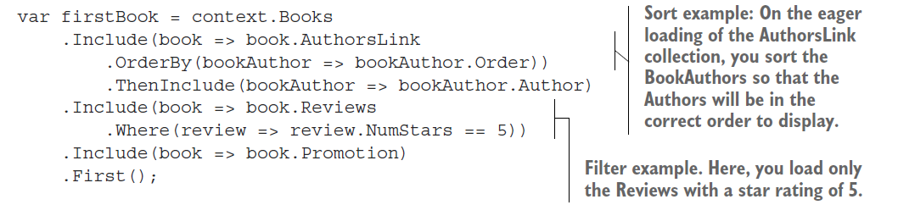

#### Explicit loading: Loading relationships after the primary entity class

The second approach to loading data is explicit loading. After you’ve loaded the primary entity class, you can explicitly load any other relationships you want. First, it loads the Book; then it uses explicit-loading commands to read all the relationships.

```csharp
public static void ExplicitLoadingOfTheBookClassAndRelatedData()
        {
            using (var context = new ApplicationDbContext())
            {
                var firstBook = context.Books.First();
                context.Entry(firstBook)
                .Collection(book => book.bookAuthors).Load();
                foreach (var authorLink in firstBook.bookAuthors)
                {
                    context.Entry(authorLink)
                    .Reference(bookAuthor =>
                    bookAuthor.Authors).Load();
                }

                context.Entry(firstBook)
                .Collection(book => book.Tags).Load();
                context.Entry(firstBook)
                .Reference(book => book.Promotion).Load();
            }
        }
```

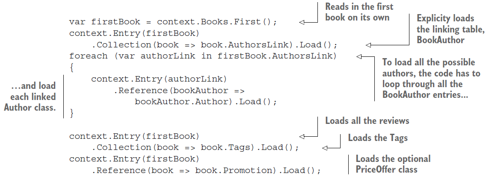

Alternatively, explicit loading can be used to apply a query to the relationship instead of loading the relationship. the use of the explicit-loading method Query to obtain the count of reviews and to load the star ratings of each review. You
can use any standard LINQ command after the **Query method, such as Where or OrderBy.**

```csharp
    public static void ExplicitingLoadingOfBookClassWithRedinedSetOfRelatedData()
        {
            using (var context = new ApplicationDbContext())
            {
                var firstBook = context.Books.First();
                var numReviews = context.Entry(firstBook)
                .Collection(book => book.Reviews)
                .Query().Count();

                var starRatings = context.Entry(firstBook)
                .Collection(book => book.Reviews)
                .Query().Select(review => review.NumStars)
                .ToList();
            }
        }
```

The advantage of explicit loading is that you can load a relationship of an entity class later. I’ve found this technique useful when I’m using a library that loads only the primary entity class, and need one of its relationships. Explicit loading can also be useful when you need that related data in only some circumstances.

#### **Select loading: Loading specific parts of primary entity class and any relationships**

The third approach to loading data is using the LINQ **Select method** to pick out the data you want, which I call select loading. The next listing shows the use of the Select method to select a few standard properties from the Book class and execute specific code inside the query to get the count of customer reviews for this book.

```csharp
     public static void SelectOfTheBookClassPickingSpecificProperticsAndOneCalculation()
        {
            using (var context = new ApplicationDbContext())
            {
                var books = context.Books
                .Select(book => new
                {
                    book.Title,
                    book.Price,
                    NumReviews
                = book.Reviews.Count,
                }
                ).ToList();

            }
        }
```

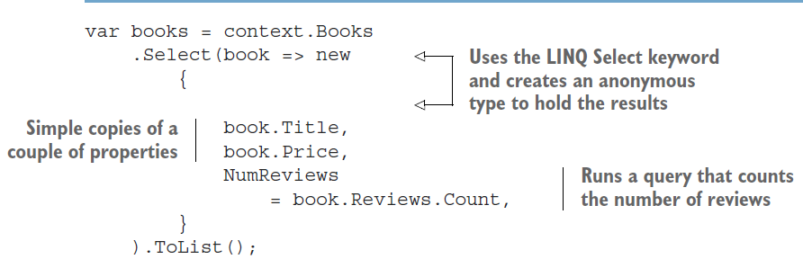

The advantage of this approach is that only the data you need is loaded, which can be more efficient if you don’t need all the data. SQL SELECT command is required to get all that data, which is also efficient in terms of database round trips. EF Core turns the p.Reviews.Count part of the query into an SQL command, so that count is done inside the database, as you can see in the following snippet of the SQL created by EF Core:

```csharp
SELECT "b"."Title", "b"."Price", (
SELECT COUNT(*)
FROM "Review" AS "r"
WHERE "b"."BookId" = "r"."BookId") AS "NumReviews"
FROM "Books" AS "b"
```

**Select query that includes a non-SQL command, string.Join**

```csharp
 public static void SelectQueryThatIncludesANonSQLCommandStringJoin()
        {
            using (var context = new ApplicationDbContext())
            {
                var firstBook = context.Books
                .Select(book => new
                {
                    book.BookId,
                    book.Title,
                    AuthorsString = string.Join(", ",
                book.bookAuthors
                .OrderBy(ba => ba.Order)
                .Select(ba => ba.Author.Name))
                }
                ).First();

            }
        }
```

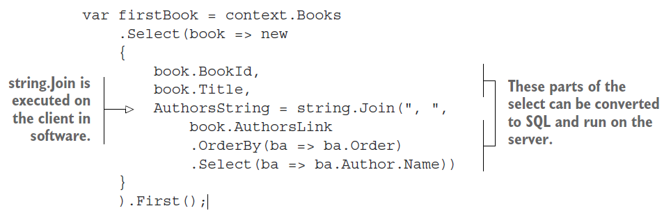

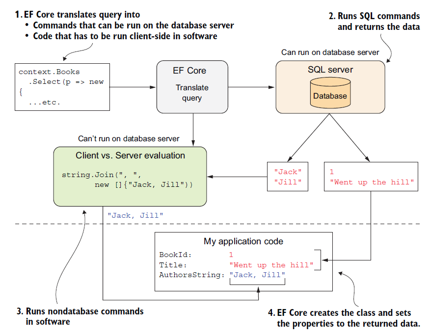

Complex Query Bundding


Each individual query needed to build the book list display, with each part of the query that’s used to provide the value needed for that part of the book display. Some queries are easy, such as getting the title of the book, but others aren’t so obvious, such as working out the average votes from the reviews.

#### Data Transfer Object

```csharp
public class BookListDto
    {
        public int BookId { get; set; }
        public string Title { get; set; }
        public DateTime PublishedOn { get; set; }
        public decimal Price { get; set; }
        public decimal ActualPrice { get; set; }
        public string PromotionPromotionalText { get; set; }
        public string AuthorsOrdered { get; set; }
        public int ReviewsCount { get; set; }
        public double?   ReviewsAverageVotes  { get; set; }
        public string[] TagStrings { get; set; }
    }
```

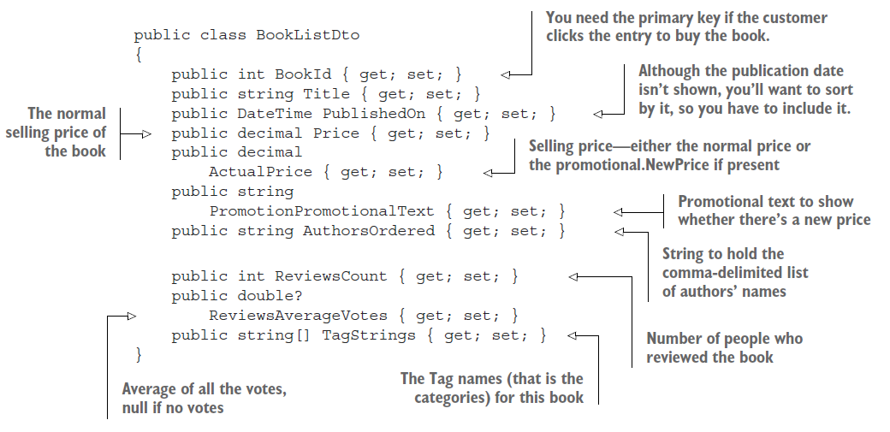

Using Extension Method  DTO To Model Data transfer

```csharp
public static IQueryable<BookListDto> MapBookToDto(this IQueryable<Book> books)
        {
            return books.Select(book => new BookListDto
            {
                BookId = book.BookId,
                Title = book.Title,
                Price = book.Price,
                PublishedOn = book.PublishedOn,

                ActualPrice = book.Promotion == null
                ? book.Price
                : book.Promotion.NewPrice,

                PromotionPromotionalText = book.Promotion == null ? null
                : book.Promotion.PromotionalText,

                AuthorsOrdered = string.Join(", ",
                book.bookAuthors.OrderBy(ba => ba.Order).Select(ba => ba.Author.Name)),

                ReviewsCount = book.Reviews.Count,
                ReviewsAverageVotes = book.Reviews.Select(review => (double?)review.NumStars).Average(),

                TagStrings = book.Tags.Select(x => x.TagId.ToString()).ToArray(),
            });
        }
```

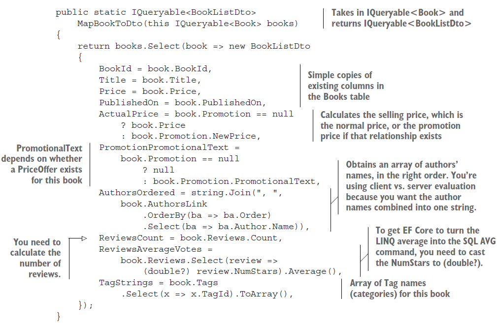

**Sorting books by price, publication date, and customer ratings**

```csharp
public static IQueryable<BookListDto> OrderBooksBy (this IQueryable<BookListDto> books, OrderByOptions orderByOptions)
        {
            switch (orderByOptions)
            {
                case OrderByOptions.SimpleOrder:
                    return books.OrderByDescending(
                    x => x.BookId);
                case OrderByOptions.ByVotes:
                    return books.OrderByDescending(x =>
                    x.ReviewsAverageVotes);
                case OrderByOptions.ByPublicationDate:
                    return books.OrderByDescending(
                    x => x.PublishedOn);
                case OrderByOptions.ByPriceLowestFirst:
                    return books.OrderBy(x => x.ActualPrice);
                case OrderByOptions.ByPriceHighestFirst:
                    return books.OrderByDescending(
                    x => x.ActualPrice);
                default:
                    throw new ArgumentOutOfRangeException(
                    nameof(orderByOptions), orderByOptions, null);
            }
        }

```

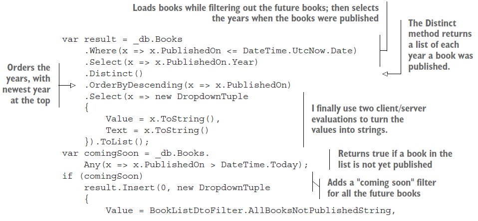

Filtering by Query Object

```csharp
public static IQueryable<BookListDto> FilterBooksBy(this IQueryable<BookListDto> books,
                        BooksFilterBy filterBy, string filterValue)
        {
            if (string.IsNullOrEmpty(filterValue))
                return books;
            switch (filterBy)
            {
                case BooksFilterBy.NoFilter:
                    return books;
                case BooksFilterBy.ByVotes:
                    var filterVote = int.Parse(filterValue);
                    return books.Where(x => x.ReviewsAverageVotes > filterVote);
                case BooksFilterBy.ByTags:
                    return books.Where(x => x.TagStrings.Any(y => y == filterValue));
                case BooksFilterBy.ByPublicationYear:
                    if (filterValue == "AllBooksNotPublishedString")
                        return books.Where(x => x.PublishedOn > DateTime.UtcNow);
                    var filterYear = int.Parse(filterValue);
                    return books.Where(
                    x => x.PublishedOn.Year == filterYear
                    && x.PublishedOn <= DateTime.UtcNow);
                default:
                    throw new ArgumentOutOfRangeException
                    (nameof(filterBy), filterBy, null);
            }
        }
```

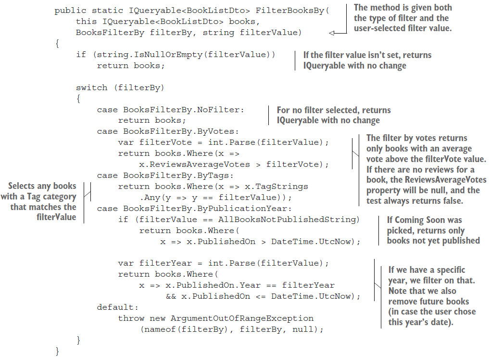

#### Other filtering options: Searching text for a specific string

We could’ve created loads of other types of filters/searches of books, and searching by title is an obvious one. But you want to make sure that the LINQ commands you use to search a string are executed in the database, because they’ll perform much better than loading all the data and filtering in software. EF Core converts the following C# code in a LINQ query to a database command: **==, Equal, StartsWith, EndsWith, Contains**, and **IndexOf**.

| String command | Example (finds a title with the string "The Cat sat on the mat.")         |
| -------------- | ------------------------------------------------------------------------- |
| StartsWith     | var books = context.Books.Where(p => p.Title.StartsWith("The")).ToList(); |
| EndsWith       | var books = context.Books.Where(p => p.Title.EndsWith("MAT.")).ToList();  |
| Contains       | var books = context.Books.Where(p => p.Title.Contains("cat"))             |

EF Core  provides various ways to set the collation in a database. Typically, you configure the collation for the database or a specific column but you can also define the collation in a query by using the **EF.Functions.Collate** method. The following code snippet sets an SQL Server collation, which means that this query will compare the string using the **Latin1_General_CS_AS** (case-sensitive) collation for this query:

```csharp
context.Books.Where( x =>
EF.Functions.Collate(x.Title, "Latin1_General_CS_AS")
== “HELP” //This does not match “help”
```

Defining what is uppercase and what is lowercase over many languages with many scripts is a complex issue! Fortunately, relational databases have been performing this task for many years, and SQL Server has more than 200 collations.

Generic Page query Method

```csharp

        public static IQueryable<T> Page<T>(this IQueryable<T> query, int pageNumZeroStart, int pageSize)
        {
            if (pageSize == 0)
                throw new ArgumentOutOfRangeException
                (nameof(pageSize), "pageSize cannot be zero.");
            if (pageNumZeroStart != 0)
                query = query
                .Skip(pageNumZeroStart * pageSize);
            return query.Take(pageSize);
        }
```

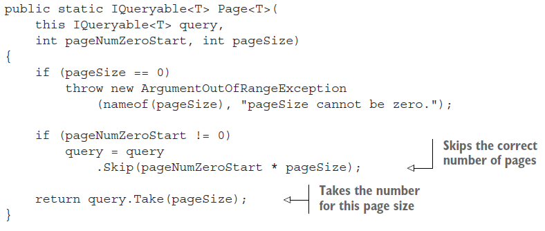

**Create a servie Class to  provied a sorted fillterd and paged**

```csharp
public class ListBooksService
    {
        private readonly ApplicationDbContext _context;
        public ListBooksService(ApplicationDbContext context)
        {
            _context = context;
        }
        public IQueryable<BookListDto> SortFilterPage
        (SortFilterPageOptions options)
        {
            var booksQuery = _context.Books
            .AsNoTracking()
            .MapBookToDto()
            .OrderBooksBy(options.OrderByOptions)
            .FilterBooksBy(options.FilterBy,  options.FilterValue);
            options.SetupRestOfDto(booksQuery);
            return booksQuery.Page(options.PageNum - 1,
            options.PageSize);
        }
    }
```

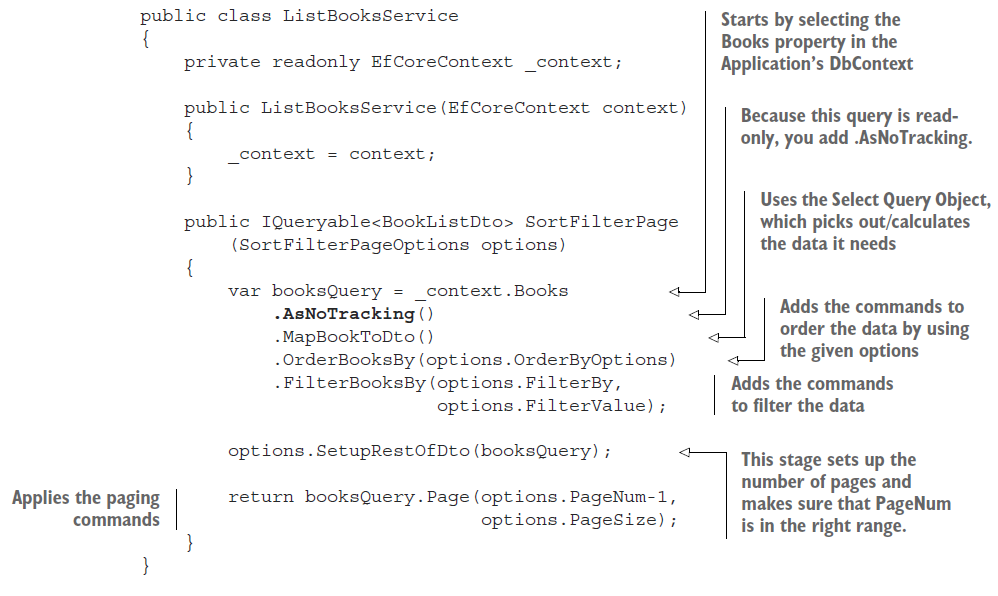
