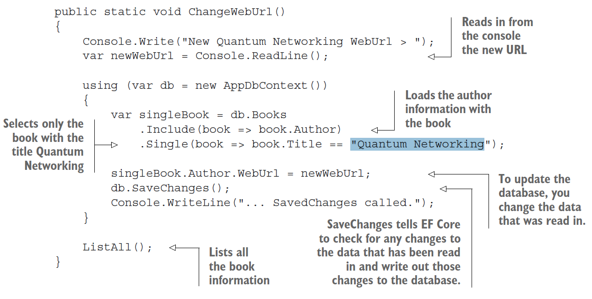
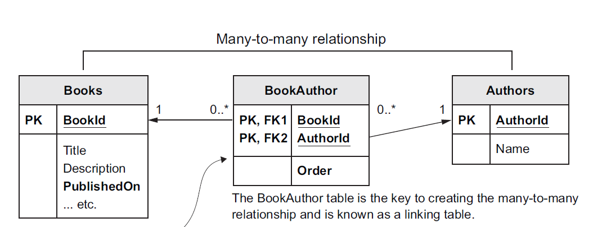
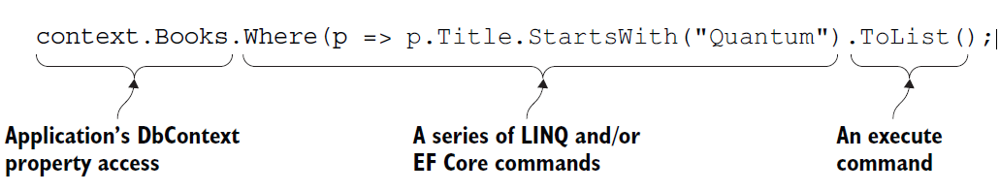
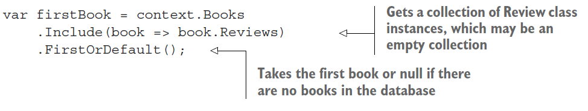
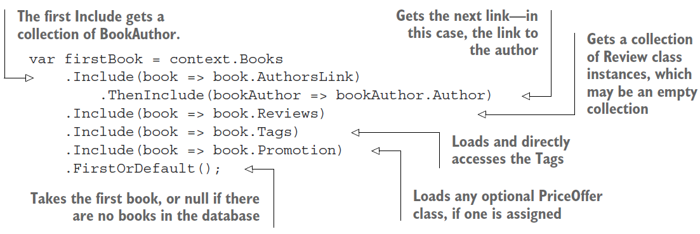
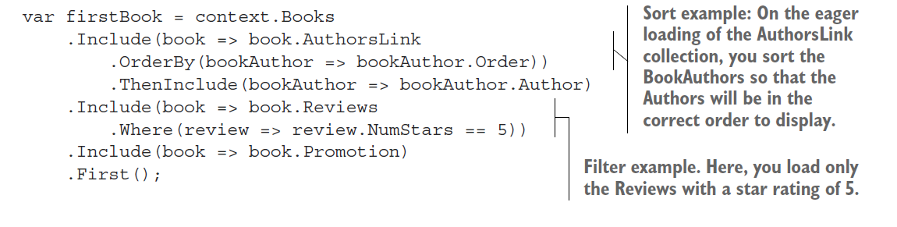
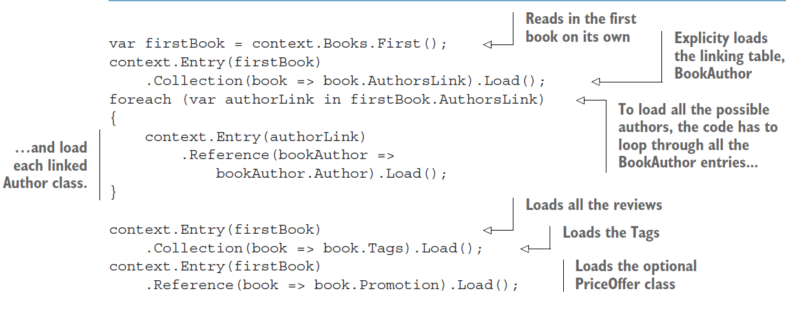
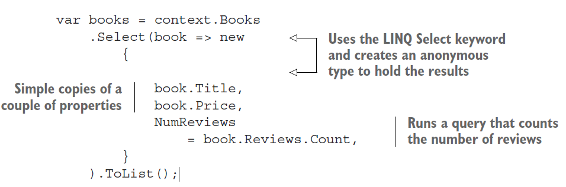

The NuGet packages are listed for the activity project using the Manage NuGet Packages for Solution option

1. Microsoft.EntityFrameworkCore
2. Microsoft.EntityFrameworkCore.Design
3. Microsoft.EntityFrameworkCore.SqlServer
4. Microsoft.EntityFrameworkCore.Tools

 add-migration Initial_Migration

You can use EF Core as an O/RM that maps between the relational database and the
.NET world of classes and software code.

***EF Core mapping between a database and .NET software***

| Relational Database                 | .NET Software                                      |
| ----------------------------------- | -------------------------------------------------- |
| Table                               | .NET class                                         |
| Table Columns                       | Class Properties/Fields                            |
| Rows                                | Elements in .NET Collections  for instance , List |
| Primay keys: unique Row             | A unique class instance                            |
| Foregin keys: define a relationship | Reference to antoher class                         |
| SQL for instance, WHERE             | .NET LINQ for instance, Where (p => ....)          |

For this MyFirstEfCoreApp application example, I created a simple database, shown in
figure  with only two tables:

1. A Books table holding the book informatio
2. An Author table holding the author of each book


ADVANCED NOTE In this example, I let EF Core name the tables using its default configuration settings. The Books table name comes from the DbSet `<Book>`

Books property  . The Author table name hasn’t got a DbSet `<T>` property, so EF Core uses the name of the class.


### The classes that map to the database: Book and Author

EF Core maps classes to database tables. Therefore, you need to create a class that will define the database table or match a database table if you already have a database


The Author property is an EF Core navigational property. EF Core uses this on a save to see whether the Book has an Author class attached. If so, it sets the foreign key, AuthorId. Upon loading a Book class, the method Include will fill this property with the Author class that's linked to this Book class by using the foreign key, AuthorId.

I ll be using: Author. This class has the same structure as the Book class  with a primary key that follows the EF Core naming
conventions of `<ClassName>`Id . The Book class also has a navigational property of type Author and an int type property called AuthorId that matches the Author’s primary key. These two properties tell EF Core that you want a link from  the Book class to the Author class and that the AuthorId property should be used as the foreign key to link the two tables in the database.


### The application's DbContext

The other important part of the application is DbContext, a class you create that inherits from EF Core’s DbContext class. This class holds the information EF Core needs to configure that database mapping and is also the class you use in your code to
access the database


### Modeling the database

Before you can do anything with the database, EF Core must go through a process that I refer to as modeling the database. This modeling is EF Core’s way of working out what the database looks like by looking at the classes and other EF Core configuration data. Then EF Core uses the resulting model in all database accesses.

The modeling process is kicked off the first time you create the application's DbContext, in this case called AppDbContext . It has one property, DbSet `<Book>`, which is the way that the code accesses the database.


the modeling steps that EF Core uses on our AppDbContext, which happens the first time you create an instance of the AppDbContext. (After that, the model is cached, so that subsequent instances are created quickly.) The following text
provides a more detailed description of the process:

1. EF Core looks at the application’s DbContext and finds all the public DbSet `<T>` properties. From this data, it defines the initial name for the one table it finds: Books.
2. EF Core looks through all the classes referred to in DbSet `<T>` and looks at its properties to work out the column names, types, and so forth. It also looks for special attributes on the class and/or properties that provide extra modeling
   information.
3. EF Core looks for any classes that the DbSet `<T>` classes refer to. In our case, the Book class has a reference to the Author class, so EF Core scans that class too. I carries out the same search on the properties of the Author class as it did on the
   Book class in step 2. It also takes the class name, Author, as the table name.
4. For the last input to the modeling process, EF Core runs the virtual method **OnModelCreating** inside the application’s **DbContext**. In this simple application, you don’t override the OnModelCreating method, but if you did, you
   could provide extra information via a fluent API to do more configuration of the modeling.

### **Reading data from the database**


EF Core uses Microsoft's .NET’s Language Integrated Query (LINQ) to carry the commands it wants done, and normal .NET classes to hold the data.

The query db.Books.AsNoTracking().Include(book => book.Author) accesses the DbSet `<Book>` property in the application’s DbContext and adds a ***.Include(book => book.Author)*** at the end to ask that the Author parts of the relationship are loaded too. This is converted by the database provider into an SQL command to access the database. The resulting SQL is cached to avoid the cost of retranslation if the same database access is used again.





RelationShips

1. One-to-one relationship—PriceOffer to a Book
2. One-to-many relationship—Book with Reviews
3. Many-to-many relationship—Books linked to Authors and Books linked to Tags

ONE-TO-ONE RELATIONSHIP: PRICEOFFER TO A BOOK

A book can have a promotional price applied to it with an optional row in the Price- Offer, which is an example of a one-to-one relationship.

Technically, the relationship is one-to-zero-or-one, but EF Core handles it the same way


I have a primary key and a foreign key to make the relationship easier to understand. But for one-to-one relationships,
you can make the foreign key be the primary key too. In the PriceOffer table , you would have a primary key, called BookId, which would also be the foreign key. As a result, you lose the PriceOfferId column, which makes the table slightly more efficient from the database side

**ONE-TO-MANY RELATIONSHIP: REVIEWS TO A BOOK**

You want to allow customers to review a book; they can give a book a star rating and optionally leave a comment. Because a book may have no reviews or many (unlimited) reviews, you need to create a table to hold that data.


In the Summary display, you need to count the number of reviews and work out the average star rating to show a summary. Here's a typical onscreen display you might produce from this one-to-many relationship

**MANY-TO-MANY RELATIONSHIP: MANUALLY CONFIGURED**

Books can be written by one or more authors, and an author may write one or more books. Therefore, you need a table called Books to hold the books data and another table called Authors to hold the authors. The link between the Books and Authors
tables is called a many-to-many relationship, which in this case needs a linking table to achieve this relationship.
In this case, you create your own linking table with an Order value in it because the names of the authors in a book must be displayed in a specific order



This table uses the foreign keys as the primary keys. Because primary keys must be unique, this ensures that only one link can exist between a book and an author.

*The three tables involved in creating the many-to-many relationship between the Books table and the Authors table. I use a many-to-many relationship because books can have many authors, and authors may have written many books. The extra feature needed here is the Order value, because the order in which authors are listed in a book matters, so I use the Order value to display the authors in the correct sequence.*

### Understanding database queries

EF Core database query, with the three main parts of the query highlighted.

```csharp
context.Books.Where(p => p.Title.StartsWith("Quantum").ToList();
```



### The execute command

The last part of the command reveals something about LINQ. Until a final execute command is applied at the end of the sequence of LINQ commands, the LINQ is held as a series of commands in what is called an expression tree.

which means that it hasn’t been executed on the data yet. EF Core can translate an expression tree into the correct commands for the database you’re using. In EF Core, a query is executed against the database when

1. It's enumerated by a foreach statement.
2. It’s enumerated by a collection operation such as ToArray, ToDictionary,
3. ToList, ToListAsync, and so forth.
4. LINQ operators such as First or Any are specified in the outermost part of the query.

   You’ll use certain EF Core commands, such as Load, in the explicit loading of a relationship later in this chapter.

   At this point, your LINQ query will be converted to database commands and sent to the database. If you want to build high-performance database queries, you want all your LINQ commands for filtering, sorting, paging, and so on to come before you call an execute command.

```csharp
context.Books.AsNoTracking().Where(p => p.Title.StartsWith("Quantum")).ToList();
```

A detailed list of the differences between the normal, read-write query and the AsNoTracking, read-only query.

#### Eager loading: Loading relationships with the primary entity class

Eager loading is specified via two fluent methods, ***Include***and ***ThenInclude***. The next listing shows the loading of the first row of the **Books** table as an instance of the **Book** entity class and the eager loading of the single relationship, **Reviews**

```csharp
var firstBook = context.Books.Include(book => book.Reviews).FirstOrDefault();
```



Now let’s look at a more complex example. The following listing shows a query to get the first Book, with eager loading of all its relationships—in this case, AuthorsLink and the second-level Author table, the Reviews, and the optional Promotion class

```csharp
var firstBook = context.Books
.Include(book => book.AuthorsLink
.OrderBy(bookAuthor => bookAuthor.Order))
.ThenInclude(bookAuthor => bookAuthor.Author)
.Include(book => book.Reviews
.Where(review => review.NumStars == 5))
.Include(book => book.Promotion)
.First
```



```csharp
var firstBook = context.Books.First();
context.Entry(firstBook)
.Collection(book => book.AuthorsLink).Load();
foreach (var authorLink in firstBook.AuthorsLink)
{
context.Entry(authorLink)
.Reference(bookAuthor =>
bookAuthor.Author).Load();
}
context.Entry(firstBook)
.Collection(book => book.Tags).Load();
context.Entry(firstBook)
.Reference(book => book.Promotion).Load();
```



The second approach to loading data is explicit loading. After you’ve loaded the primary entity class, you can explicitly load any other relationships you want explicit loading .First, it loads the Book; then it uses explicit-loading commands to read all the relationships.



Alternatively, explicit loading can be used to apply a query to the relationship instead of loading the relationship.  shows the use of the explicit-loading method *Query* to obtain the count of reviews and to load the star ratings of each review.

You can use any standard LINQ command after the Query method, such as *Where* or *OrderBy*

```csharp
var firstBook = context.Books.First();
var numReviews = context.Entry(firstBook)
.Collection(book => book.Reviews)
.Query().Count();

var starRatings = context.Entry(firstBook)
.Collection(book => book.Reviews)
.Query().Select(review => review.NumStars)
.ToList();
```

### Select loading: Loading specific parts of primary entity class and any relationships

```csharp
var books = context.Books
.Select(book => new
{
book.Title,
book.Price,
NumReviews = book.Reviews.Count,
}).ToList();
```



#### **Lazy loading: Loading relationships as required**

Lazy loading makes writing queries easy, but it has a bad effect on database performance. Lazy loading does require some changes to your DbContext or your entity classes, but after you make those changes, reading is easy; if you access a navigational property that isn’t loaded, EF Core will execute a database query to load that navigational
property. You can set up lazy loading in either of two ways

1. Adding the Microsoft.EntityFrameworkCore.Proxies library when configuring your DbContext
2. Injecting a lazy loading method into the entity class via its constructor
