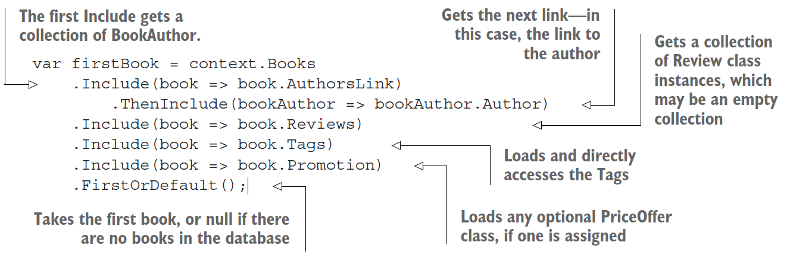
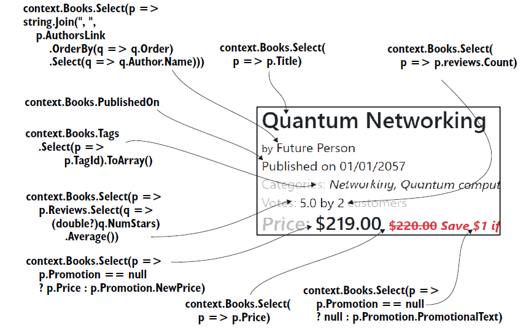

Intall From Nuget Package

Microsoft.EntityFrameworkCore

Microsoft.EntityFrameworkCore.Design

Microsoft.EntityFrameworkCore.Tools

Microsoft.EntityFrameworkCore.SqlServer

**Overview of EF Core**

You can use EF Core as an O/RM that maps between the relational database and the .NET world of classes and software code.

| Relational database                 | .NET software                                    |
| ----------------------------------- | ------------------------------------------------ |
| Table                               | .NET class                                       |
| Table columns                       | Class properties/fields                          |
| Rows                                | Elements in .NET collections—for instance, List |
| Primary keys: unique row            | A unique class instance                          |
| Foreign keys: define a relationship | Reference to another class                       |
| SQL—for instance, WHERE            | .NET LINQ—for instance, Where(p => …           |

Tables In Database

1. A Books table holding the book information
2. An Author table holding the author of each book


**Relational database with two tables: Books and Author**

The Books table name comes from the ****DbSet `<Book>` Books**** property.

 The Authors table name comes from the DbSet `<Author>` Author property.

### The classes that map to the database: Book and Author

EF Core maps classes to database tables. Therefore, you need to create a class that will define the database table or match a database table if you already have a database. Lots of rules and configurations exist

```csharp
using System;
using System.Collections.Generic;
using System.Linq;
using System.Text;
using System.Threading.Tasks;

namespace EFCoreSecondConsoleApp.Models
{
    public class Book
    {
        public int BookId { get; set; }
        public string Title { get; set; }
        public string Description { get; set; }
        public DateTime PublishedOn { get; set; }
        public int AuthorId { get; set; }
        public Author Author { get; set; }
    }
}

```


The.NET class Book, on the left, maps to a database table called Books, on the right. This is a typical way to build your application, with multiple classes that map to database tables.

This class has the same structure as the Book class with a primary key that follows the EF Core naming conventions of `<ClassName>`Id  example Book as primary key **BookId**

The Book class also has a navigational property of type Author and an int type property called AuthorId that matches
the Author's primary key. These two properties tell EF Core that you want a link from the Book class to the Author class and that the AuthorId property should be used as the foreign key to link the two tables in the database.

**The Author class**

```csharp
namespace EFCoreSecondConsoleApp.Models
{
    public class Author
    {
        public int AuthorId { get; set; }
        public string Name { get; set; }
        public string WebUrl { get; set; }

    }
}
```


#### The application's DbContext

The other important part of the application is DbContext, a class you create that inherits from EF Core’s DbContext class. This class holds the information EF Core needs to configure that database mapping and is also the class you use in your code to
access the database

**You must have a class that inherits from the EF Core class DbContext. This class holds the information and configuration for accessing your database.**

```csharp
public class ApplicationDbContext : DbContext
{
private const string ConnectionString =
@"Server=(localdb)\mssqllocaldb;
Database=MyFirstEfCoreDb;
Trusted_Connection=True”;
protected override void OnConfiguring(
DbContextOptionsBuilder optionsBuilder)
{
optionsBuilder
.UseSqlServer(connectionString);
}
public DbSet<Book> Books { get; set; }
```


#### Modeling the database

Before you can do anything with the database, EF Core must go through a process that I refer to as modeling the database

This modeling is EF Core’s way of working out what the database looks like by looking at the classes and other EF Core configuration data. Then EF Core uses the resulting model in all database accesses. The modeling process is kicked off the first time you create the application's **DbContext**, in this case called **ApplicationDbContext**. It has one property, **DbSet** `<Book>`, which is the way that the code accesses the database


EF Core will create a model of the database your classes map to. First, it looks at the classes you have defined via the DbSet `<T>` properties; then it looks down all the references to other classes. Using these classes, EF Core can work out the default model of the database. But then it runs the OnModelCreating method in the application's DbContext, which you can override to add your specific commands to configure the database the way you want it.

the modeling steps that EF Core uses on our AppDbContext, which happens the first time you create an instance of the AppDbContext.

#### Reading data from the database

Reads All Books and Authors

```csharp
 using (var db = new ApplicationDbContext())
            {
                foreach (var book in
                db.Books.AsNoTracking()
                .Include(book => book.Author))
                {
                    var webUrl = book.Author.WebUrl == null
                    ? "- no web URL given -"
                    : book.Author.WebUrl;
                    Console.WriteLine(
                    $"{book.Title} by {book.Author.Name}");
                    Console.WriteLine(" " +
                    "Published on " +
                    $"{book.PublishedOn:dd-MMM-yyyy}" +
                    $". {webUrl}");
                }
            }
```


EF Core uses Microsoft’s .NET’s Language Integrated Query (LINQ) to carry the commands it wants done, and normal .NET classes to hold the data.

The query **db.Books.AsNoTracking().Include(book => book.Author)** accesses the *DbSet `<Book>`* property in the application's **DbContext** and adds a .Include
**(book => book.Author)** at the end to ask that the Author parts of the relationship are loaded too. This is converted by the database provider into an SQL command to access the database. The resulting SQL is cached to avoid the cost of retranslation if the same database access is used again


**SQL command produced to read Books and Author**

```csharp
SELECT [b].[BookId],
[b].[AuthorId],
[b].[Description],
[b].[PublishedOn],
[b].[Title],
[a].[AuthorId],
[a].[Name],
[a].[WebUrl]
FROM [Books] AS [b]
INNER JOIN [Author] AS [a] ON
[b].[AuthorId] = [a].[AuthorId]
```

**The code to update the author's WebUrl of the book Quantum Networking**

```csharp
 public static void ChangeWebUrl()
        {
            Console.Write("New Quantum Networking WebUrl > ");
            var newWebUrl = Console.ReadLine();
            using (var db = new ApplicationDbContext())
            {
                var singleBook = db.Books
                .Include(book => book.Author)
                .Single(book => book.Title == "Quantum Networking");
                singleBook.Author.WebUrl = newWebUrl;
                db.SaveChanges();
                Console.WriteLine("... SavedChanges called.");
            }
            ListAll();
        }
```


#### The execute command

EF Core can translate an expression tree into the correct commands for the database you’re using. In EF Core, a query is executed against the database when

1. It's enumerated by a foreach statement.
2. It's enumerated by a collection operation such as **ToArray, ToDictionary, ToList, ToListAsync**, and so forth.
3. LINQ operators such as First or Any are specified in the outermost part of the query

You'll use certain EF Core commands, such as Load, in the explicit loading of a relationship later in this chapter.

#### The two types of database queries

The other type of query is an **AsNoTracking** query, also known as a **read-only query**. This query has the EF Core’s **AsNoTracking** method added to the LINQ query.

As well as making the query **read-only**, the **AsNoTracking** method improves the performance of the query by turning off certain EF Core features.

```csharp
context.Books.AsNoTracking().Where(p => p.Title.StartsWith("Quantum")).ToList();
```

provides a detailed list of the differences between the normal, **read-write** query and the **AsNoTracking**, read-only query.

#### Eager loading: Loading relationships with the primary entity class

The first approach to loading related data is eager loading, which entails telling EF Core to load the relationship in the same query that loads the primary entity class. Eager loading is specified via two fluent methods, **Include and ThenInclude**. The next listing shows the loading of the first row of the Books table as an instance of the Book entity class and the eager loading of the single relationship, Reviews.

```csharp
var firstBook = context.Books
.Include(book => book.Reviews)
.FirstOrDefault();
```


```csharp

SELECT "t"."BookId", "t"."Description", "t"."ImageUrl",
"t"."Price", "t"."PublishedOn", "t"."Publisher",
"t"."Title", "r"."ReviewId", "r"."BookId",
"r"."Comment", "r"."NumStars", "r"."VoterName"
FROM (
SELECT "b"."BookId", "b"."Description", "b"."ImageUrl",
"b"."Price", "b"."PublishedOn", "b"."Publisher", "b"."Title"
FROM "Books" AS "b"
LIMIT 1
) AS "t"
LEFT JOIN "Review" AS "r" ON "t"."BookId" = "r"."BookId"
ORDER BY "t"."BookId", "r"."ReviewId"
```

#### Eager loading of the Book class and all the related data

```csharp
var firstBook = context.Books
.Include(book => book.AuthorsLink)
.ThenInclude(bookAuthor => bookAuthor.Author)
.Include(book => book.Reviews)
.Include(book => book.Tags)
.Include(book => book.Promotion)
.FirstOrDefault();
```



The listing shows the use of the eager-loading method **Include** to get the Authors-Link relationship. This relationship is a first-level relationship, referred to directly from the entity class you're loading. That **Include** is followed by **ThenInclude** to load
the second-level relationship—in this case, the Author table at the other end of the linking table, **BookAuthor**. This pattern, **Include** followed by **ThenInclude**, is the  standard way of accessing relationships that go deeper than a first-level relationship.
You can go to any depth with multiple **ThenIncludes**, one after the other.

If you use the direct linking of **many-to-many** relationships **introduced** in EF Core you don't need **ThenInclude** to load the second-level relationship because the property directly accesses the other end of the **many-to-many** relationship via the Tags
property, which is of type **ICollection `<Tag>`.**

Eager loading in EF Core is similar to that in EF6.x, but EF6.x doesn't have a ThenInclude method.

```csharp
context.Books.Include(book => book.AuthorLink.Select(bookAuthor => bookAuthor.Author).
```

The same rule applies to ThenInclude: if the previous **Include** or **ThenInclude** was empty, subsequent **ThenIncludes** are ignored. If you don't **Include** a collection, it is null by default.

**SORTING AND FILTERING WHEN USING INCLUDE AND/OR THENINCLUDE**

The only LINQ commands you can use in the **Include or ThenInclude** methods are **Where, OrderBy, OrderByDescending, ThenBy, ThenByDescending, Skip, and Take**, but those commands are all you need for sorting and filtering

```csharp
var firstBook = context.Books
.Include(book => book.AuthorsLink
.OrderBy(bookAuthor => bookAuthor.Order))
.ThenInclude(bookAuthor => bookAuthor.Author)
.Include(book => book.Reviews
.Where(review => review.NumStars == 5))
.Include(book => book.Promotion)
.First();
```


#### Explicit loading: Loading relationships after the primary entity class

The second approach to loading data is explicit loading. After you’ve loaded the primary entity class, you can explicitly load any other relationships you want. First, it loads the Book; then it uses explicit-loading commands to read all the relationships.

```csharp
public static void ExplicitLoadingOfTheBookClassAndRelatedData()
        {
            using (var context = new ApplicationDbContext())
            {
                var firstBook = context.Books.First();
                context.Entry(firstBook)
                .Collection(book => book.bookAuthors).Load();
                foreach (var authorLink in firstBook.bookAuthors)
                {
                    context.Entry(authorLink)
                    .Reference(bookAuthor =>
                    bookAuthor.Authors).Load();
                }

                context.Entry(firstBook)
                .Collection(book => book.Tags).Load();
                context.Entry(firstBook)
                .Reference(book => book.Promotion).Load();
            }
        }
```


Alternatively, explicit loading can be used to apply a query to the relationship instead of loading the relationship. the use of the explicit-loading method Query to obtain the count of reviews and to load the star ratings of each review. You
can use any standard LINQ command after the **Query method, such as Where or OrderBy.**

```csharp
    public static void ExplicitingLoadingOfBookClassWithRedinedSetOfRelatedData()
        {
            using (var context = new ApplicationDbContext())
            {
                var firstBook = context.Books.First();
                var numReviews = context.Entry(firstBook)
                .Collection(book => book.Reviews)
                .Query().Count();

                var starRatings = context.Entry(firstBook)
                .Collection(book => book.Reviews)
                .Query().Select(review => review.NumStars)
                .ToList();
            }
        }
```

The advantage of explicit loading is that you can load a relationship of an entity class later. I’ve found this technique useful when I’m using a library that loads only the primary entity class, and need one of its relationships. Explicit loading can also be useful when you need that related data in only some circumstances.

#### **Select loading: Loading specific parts of primary entity class and any relationships**

The third approach to loading data is using the LINQ **Select method** to pick out the data you want, which I call select loading. The next listing shows the use of the Select method to select a few standard properties from the Book class and execute specific code inside the query to get the count of customer reviews for this book.

```csharp
     public static void SelectOfTheBookClassPickingSpecificProperticsAndOneCalculation()
        {
            using (var context = new ApplicationDbContext())
            {
                var books = context.Books
                .Select(book => new
                {
                    book.Title,
                    book.Price,
                    NumReviews
                = book.Reviews.Count,
                }
                ).ToList();

            }
        }
```


The advantage of this approach is that only the data you need is loaded, which can be more efficient if you don’t need all the data. SQL SELECT command is required to get all that data, which is also efficient in terms of database round trips. EF Core turns the p.Reviews.Count part of the query into an SQL command, so that count is done inside the database, as you can see in the following snippet of the SQL created by EF Core:

```csharp
SELECT "b"."Title", "b"."Price", (
SELECT COUNT(*)
FROM "Review" AS "r"
WHERE "b"."BookId" = "r"."BookId") AS "NumReviews"
FROM "Books" AS "b"
```

**Select query that includes a non-SQL command, string.Join**

```csharp
 public static void SelectQueryThatIncludesANonSQLCommandStringJoin()
        {
            using (var context = new ApplicationDbContext())
            {
                var firstBook = context.Books
                .Select(book => new
                {
                    book.BookId,
                    book.Title,
                    AuthorsString = string.Join(", ",
                book.bookAuthors
                .OrderBy(ba => ba.Order)
                .Select(ba => ba.Author.Name))
                }
                ).First();

            }
        }
```


Complex Query Bundding



Each individual query needed to build the book list display, with each part of the query that’s used to provide the value needed for that part of the book display. Some queries are easy, such as getting the title of the book, but others aren’t so obvious, such as working out the average votes from the reviews.

#### Data Transfer Object

```csharp
public class BookListDto
    {
        public int BookId { get; set; }
        public string Title { get; set; }
        public DateTime PublishedOn { get; set; }
        public decimal Price { get; set; }
        public decimal ActualPrice { get; set; }
        public string PromotionPromotionalText { get; set; }
        public string AuthorsOrdered { get; set; }
        public int ReviewsCount { get; set; }
        public double?   ReviewsAverageVotes  { get; set; }
        public string[] TagStrings { get; set; }
    }
```


Using Extension Method  DTO To Model Data transfer

```csharp
public static IQueryable<BookListDto> MapBookToDto(this IQueryable<Book> books)
        {
            return books.Select(book => new BookListDto
            {
                BookId = book.BookId,
                Title = book.Title,
                Price = book.Price,
                PublishedOn = book.PublishedOn,

                ActualPrice = book.Promotion == null
                ? book.Price
                : book.Promotion.NewPrice,

                PromotionPromotionalText = book.Promotion == null ? null
                : book.Promotion.PromotionalText,

                AuthorsOrdered = string.Join(", ",
                book.bookAuthors.OrderBy(ba => ba.Order).Select(ba => ba.Author.Name)),

                ReviewsCount = book.Reviews.Count,
                ReviewsAverageVotes = book.Reviews.Select(review => (double?)review.NumStars).Average(),

                TagStrings = book.Tags.Select(x => x.TagId.ToString()).ToArray(),
            });
        }
```


**Sorting books by price, publication date, and customer ratings**

```csharp
public static IQueryable<BookListDto> OrderBooksBy (this IQueryable<BookListDto> books, OrderByOptions orderByOptions)
        {
            switch (orderByOptions)
            {
                case OrderByOptions.SimpleOrder:
                    return books.OrderByDescending(
                    x => x.BookId);
                case OrderByOptions.ByVotes:
                    return books.OrderByDescending(x =>
                    x.ReviewsAverageVotes);
                case OrderByOptions.ByPublicationDate:
                    return books.OrderByDescending(
                    x => x.PublishedOn);
                case OrderByOptions.ByPriceLowestFirst:
                    return books.OrderBy(x => x.ActualPrice);
                case OrderByOptions.ByPriceHighestFirst:
                    return books.OrderByDescending(
                    x => x.ActualPrice);
                default:
                    throw new ArgumentOutOfRangeException(
                    nameof(orderByOptions), orderByOptions, null);
            }
        }

```


Filtering by Query Object

```csharp
public static IQueryable<BookListDto> FilterBooksBy(this IQueryable<BookListDto> books,
                        BooksFilterBy filterBy, string filterValue)
        {
            if (string.IsNullOrEmpty(filterValue))
                return books;
            switch (filterBy)
            {
                case BooksFilterBy.NoFilter:
                    return books;
                case BooksFilterBy.ByVotes:
                    var filterVote = int.Parse(filterValue);
                    return books.Where(x => x.ReviewsAverageVotes > filterVote);
                case BooksFilterBy.ByTags:
                    return books.Where(x => x.TagStrings.Any(y => y == filterValue));
                case BooksFilterBy.ByPublicationYear:
                    if (filterValue == "AllBooksNotPublishedString")
                        return books.Where(x => x.PublishedOn > DateTime.UtcNow);
                    var filterYear = int.Parse(filterValue);
                    return books.Where(
                    x => x.PublishedOn.Year == filterYear
                    && x.PublishedOn <= DateTime.UtcNow);
                default:
                    throw new ArgumentOutOfRangeException
                    (nameof(filterBy), filterBy, null);
            }
        }
```


#### Other filtering options: Searching text for a specific string

We could’ve created loads of other types of filters/searches of books, and searching by title is an obvious one. But you want to make sure that the LINQ commands you use to search a string are executed in the database, because they’ll perform much better than loading all the data and filtering in software. EF Core converts the following C# code in a LINQ query to a database command: **==, Equal, StartsWith, EndsWith, Contains**, and **IndexOf**.

| String command | Example (finds a title with the string "The Cat sat on the mat.")         |
| -------------- | ------------------------------------------------------------------------- |
| StartsWith     | var books = context.Books.Where(p => p.Title.StartsWith("The")).ToList(); |
| EndsWith       | var books = context.Books.Where(p => p.Title.EndsWith("MAT.")).ToList();  |
| Contains       | var books = context.Books.Where(p => p.Title.Contains("cat"))             |

EF Core  provides various ways to set the collation in a database. Typically, you configure the collation for the database or a specific column but you can also define the collation in a query by using the **EF.Functions.Collate** method. The following code snippet sets an SQL Server collation, which means that this query will compare the string using the **Latin1_General_CS_AS** (case-sensitive) collation for this query:

```csharp
context.Books.Where( x =>
EF.Functions.Collate(x.Title, "Latin1_General_CS_AS")
== “HELP” //This does not match “help”
```

Defining what is uppercase and what is lowercase over many languages with many scripts is a complex issue! Fortunately, relational databases have been performing this task for many years, and SQL Server has more than 200 collations.

Generic Page query Method

```csharp

        public static IQueryable<T> Page<T>(this IQueryable<T> query, int pageNumZeroStart, int pageSize)
        {
            if (pageSize == 0)
                throw new ArgumentOutOfRangeException
                (nameof(pageSize), "pageSize cannot be zero.");
            if (pageNumZeroStart != 0)
                query = query
                .Skip(pageNumZeroStart * pageSize);
            return query.Take(pageSize);
        }
```


**Create a servie Class to  provied a sorted fillterd and paged**

```csharp
public class ListBooksService
    {
        private readonly ApplicationDbContext _context;
        public ListBooksService(ApplicationDbContext context)
        {
            _context = context;
        }
        public IQueryable<BookListDto> SortFilterPage
        (SortFilterPageOptions options)
        {
            var booksQuery = _context.Books
            .AsNoTracking()
            .MapBookToDto()
            .OrderBooksBy(options.OrderByOptions)
            .FilterBooksBy(options.FilterBy,  options.FilterValue);
            options.SetupRestOfDto(booksQuery);
            return booksQuery.Page(options.PageNum - 1,
            options.PageSize);
        }
    }
```


#### EF Core's entity State

EF Core's entity property, called State. This property provides another look under the hood at the way EF Core does things, which helps you understand what's going on when you ***add, update, or delete*** entities.

Any entity class instance has a State, which can be accessed via the following EF Core command: ***context.Entry(someEntityInstance).State***.

The State tells EF Core what to do with this instance when SaveChanges is called. Here’s a list of the possible states and what happens if SaveChanges is called:

1. **Added**—The entity needs to be created in the database. SaveChanges inserts it.
2. **Unchanged**—The entity exists in the database and hasn’t been modified on the client. SaveChanges ignores it.
3. **Modified**—The entity exists in the database and has been modified on the client. SaveChanges updates it.
4. **Deleted**—The entity exists in the database but should be deleted. SaveChanges deletes it.
5. **Detached**—The entity you provided isn't tracked. SaveChanges doesn't see it.

**DEFINITION** Tracked entities are entity instances that have been read in from the database by using a query that didn’t include the AsNoTracking method. Alternatively, after an entity instance has been used as a parameter to EF Core methods (such as **Add, Update, or Delete**), it becomes tracked

#### Creating a single entity on its own

Let's start with an entity class that has no navigational properties—that is, relationships to other tables in your database. This example is rare but shows the two steps in a create operation:

1 Add the entity to the application’s DbContext.
2 Call the application’s DbContext’s SaveChanges method.

```csharp
public void ExampleSaveEntry()
        {
            try
            {
                var items = new ExampleEntity { Name = "Test One" };

                _context.Add(items);
                _context.SaveChanges();
                Console.WriteLine("Data has been Save");
            }
            catch (Exception ex)
            {
                Console.WriteLine("Data not save");
            }
        }
```


#### Creating a book with a review

Next, you'll look at a create that includes relationships—in this case, adding a new book with a review.


**Add a Book Entity Class also Adds any link Entity Classes**

```csharp
public void AddBookWithReviews()
        {
            var book = new Book
            {
                Title = "New Book Added",
                Description = "This is a description Two who we are",
                Price = 100,
                Reviews = new List<Review> { new Review { NumStars = 5, Comment="this is comment", VoterName="kamal passa" } },
                Tags = new List<Tag> { new Tag { 
                     TagName = "abc tag",
                      TagValue = "we have a gat value",
                } },

                Author = new Author { Name ="kamal ", WebUrl = "http://abc.com" },

            };

            try
            {
                _context.Add(book);
                _context.SaveChanges();

                Console.WriteLine("data has been saved");

            }catch(Exception ex)
            {
                Console.WriteLine("Data has not been save");
            }

        }
```


**Adding A book With an Existing Author**

```csharp
public void AddExistingAuthorBook()
        {
            var foundAuthor = _context.Author.SingleOrDefault(author => author.Name == "Eric Evans");
            if (foundAuthor == null)  throw new Exception("Author not found");
            var book = new Book
            {
                Title = "Test Book",
                PublishedOn = DateTime.Today,
                AuthorId = foundAuthor.AuthorId,
            };
            book.bookAuthors = new List<BookAuthor>
                {
                    new BookAuthor
                    {
                        Books = new List<Book>{ book },
                        Author = foundAuthor
                    }
                };

            try
            {
                _context.Add(book);
                _context.SaveChanges();

                Console.WriteLine("Sava data ");

            }catch(Exception ex)
            {
                Console.WriteLine("data not save");
            }
        }
```


#### Updating database rows

Updating a database row is achieved in three stages:
1 Read the data (database row), possibly with some relationships.
2 Change one or more properties (database columns).
3 Write the changes back to the database (update the row).

In this section, you’ll ignore any relationships and focus on the three stages. In the next section, you’ll learn how to update relationships by adding more commands to each stage.

changes the publication date of an existing book. Through this code, you can see the standard flow of an update:
1 You load the entity class(es) you want to change as a tracked entity.
2 You change the property/properties in your entity class(es).
3 You call SaveChanges to update the database.

```csharp
var book = context.Books
.SingleOrDefault(p =>
p.Title == "Quantum Networking");
if (book == null)
throw new Exception("Book not found");
book.PublishedOn = new DateTime(2058, 1, 1);
context.SaveChanges();
```


When the SaveChanges method is called, it runs a method called DetectChanges, which compares the tracking snapshot against the entity class instance that it handed to the application when the query was originally executed. From this example, EF Core decides that only the PublishedOn property has been changed, and EF Core builds the SQL to update that property.


##### **ChangePubDateDto sends data to and receives it from the user**


```csharp
public class ChangePubDateDto
{
public int BookId { get; set; }
public string Title { get; set; }
[DataType(DataType.Date)]
public DateTime PublishedOn { get; set; }
}
```

**The quickest way to read an entity class using its primary key(s)**

When you want to update a specific entity and need to read it in using its primary key, you have a few options. I used to use the Find command, but after some digging, I now recommend SingleOrDefault because it’s quicker than the Find command. But I should point out two useful things about the Find method:

1. The Find method checks the current application's **DbContext** to see whether the required entity instance has already been loaded, which can save an access to the database.  But if the entity isn't in the application's **DbContext**, the load will be slower because of this extra check.
2. The Find method is simpler and quicker to type because it's shorter than the SingleOrDefault version, such as **context.Find `<Book>`(key)** versus **context.SingleOrDefault(p => p.Bookid == key)**. The upside of using the **SingleOrDefault** method is that you can add it to the end of a query with methods such as Include, which you can’t do with Find.

#### The ChangePubDateService class to handle the disconnected update


**NOTE** You can see this code and try updating the publication date on the example Book App. If you download the code from the Git repo and run it locally, you'll see an Admin button for each book. This button contains a link called **Change Pub Date**, which will step you through this process. You can also see the SQL commands that EF Core uses to carry out this update via the Logs menu item.

**DISCONNECTED UPDATE, SENDING ALL THE DATA**

In some cases, all the data may be sent back, so there’s no reason to reload the original data. This can happen for simple entity classes, in some RESTful APIs, or processto-process communication. A lot depends on how closely the given API format matches the database format and how much you trust the other system.


#### Simulating an update/replace request from an external system

```csharp
public void GetDataFromDataBase()
        {
            var author = _context.Books
                .Where(p => p.Title == "Quantum Networking")
                .Select(p => p.bookAuthors.First().Author)
                .Single();
            author.Name = "Future Person 2";
            json = JsonConvert.SerializeObject(author);

        }

        public void DeserialiseDataOfJsonFormat()
        {
            var author = JsonConvert.DeserializeObject<Author>(json);
            _context.Author.Update(author);
            _context.SaveChanges();
        }
```

#### Handling relationships in updates

Now that we’ve established the three basic steps for updating the database, it’s time to look at updating relationships between entity classes—adding a new review to a book, for example. Updating relationships adds another level of complexity to the code, especially in the disconnected state, which is why I put this content in a separate section.


**Principal and dependent relationships**

The terms principal and dependent are used in EF to define parts of a relationship:

1. Principal entity—Contains a primary key that the dependent relationship refer to via a foreign key
2. Dependent entity—Contains the foreign key that refers to the principal entity’s primary key

An entity class can be both a principal and a dependent entity at the same time. In a hierarchical relationship of, say, libraries with books that have reviews, the book would be a dependent relationship of the library entity class.

#### Updating one-to-one relationships: 3.4.2 Adding a PriceOffer to a book

```csharp
public class PriceOffer
{
public int PriceOfferId { get; set; }
public decimal NewPrice { get; set; }
public string PromotionalText { get; set; }
//-----------------------------------------------
//Relationships
public int BookId { get; set; }
}
```


**CONNECTED STATE UPDATE**

1 Load the Book entity with any existing PriceOffer relationship.
2 Set the relationship to the new PriceOffer entity you want to apply to this book.
3 Call SaveChanges to update the database.

```csharp
 public void AddingNewPromosionPriceToExistingBook()
        {
            /*
             * Finds a book. In this example, the book doesn’t have an existing promotion, but it would also work if there were an existing promotion.
             */
            var book = _context.Books.Include(p => p.Promotion).First(p => p.Promotion == null);
            book.Promotion = new Promotion
            {
                NewPrice = book.Price / 2,
                PromotionalText = "Half price today!"
            };
            _context.SaveChanges();
        }
```


As you can see, the update of the relationship is like the basic update you made to change the book’s published date. In this case, EF Core has to do extra work because of the relationship. EF Core creates a new row in the PriceOffers table, which you can see in the SQL snippet that EF Core produces for the code

#### ChangePriceOfferService class with a method to handle each stage

```csharp
public class ChangePriceOfferService : IChangePriceOfferService
{
private readonly EfCoreContext _context;
public Book OrgBook { get; private set; }
public ChangePriceOfferService(EfCoreContext context)
{
_context = context;
}
public PriceOffer GetOriginal(int id)
{
OrgBook = _context.Books
.Include(r => r.Promotion)
.Single(k => k.BookId == id);
return OrgBook?.Promotion
?? new PriceOffer
{
BookId = id,
NewPrice = OrgBook.Price
};
}
public Book AddUpdatePriceOffer(PriceOffer promotion)
{
var book = _context.Books
.Include(r => r.Promotion)
.Single(k => k.BookId
== promotion.BookId);
if (book.Promotion == null)
{
book.Promotion = promotion;
}
else
{
book.Promotion.NewPrice
= promotion.NewPrice;
book.Promotion.PromotionalText
= promotion.PromotionalText;
}
_context.SaveChanges();
return book;
}
}
```


#### ALTERNATIVE WAY OF UPDATING THE RELATIONSHIP: CREATING A NEW ROW DIRECTLY

```csharp
var book = context.Books
.First(p => p.Promotion == null);
context.Add( new PriceOffer
{
BookId = book.BookId,
NewPrice = book.Price / 2,
PromotionalText = "Half price today!"
});
context.SaveChanges();
```


#### Adding a review to a book in the connected state


```csharp
var book = context.Books
.Include(p => p.Reviews)
.First();
book.Reviews.Add(new Review
{
VoterName = "Unit Test",
NumStars = 5,
Comment = "Great book!"
});
context.SaveChanges();
```


#### ALTERING/REPLACING ALL THE ONE-TO-MANY RELATIONSHIPS

Before moving on to the disconnected state update, I want to consider the case in which you want to alter or replace the whole collection, rather than add to the collection, as you did with the review.

If the books had categories (say, Software Design, Software Languages, and so on), you might allow an admin user to change the categories. One way to implement this change would be to show the current categories in a multiselect list, allow the admin user to change them, and then replace all the categories on the book with the new selection.

#### Replacing a whole collection of reviews with another collection

```csharp
var book = context.Books
.Include(p => p.Reviews)
.Single(p => p.BookId == twoReviewBookId);
book.Reviews = new List<Review>
{
new Review
{
VoterName = "Unit Test",
NumStars = 5,
}
};
context.SaveChanges();
```


#### DISCONNECTED-STATE UPDATE

```csharp
public class AddReviewService
{
private readonly EfCoreContext _context;
public string BookTitle { get; private set; }
public AddReviewService(EfCoreContext context)
{
_context = context;
}
public Review GetBlankReview(int id)
{
BookTitle = _context.Books
.Where(p => p.BookId == id)
.Select(p => p.Title)
.Single();
return new Review
{
BookId = id
};
}
public Book AddReviewToBook(Review review)
{
var book = _context.Books
.Include(r => r.Reviews)
.Single(k => k.BookId
== review.BookId);
book.Reviews.Add(review);
_context.SaveChanges();
return book;
}
}
```


##### Updating a many-to-many relationship

In EF Core, we talk about many-to-many relationships, but a relational database doesn't directly implement many-to-many relationships. Instead, we're dealing with two oneto-many relationships


A many-to-many relationship in the database is created by a linking table that contains the primary keys of the two tables that need a many-to-many relationship.

In EF Core, you have two ways to create many-to-many relationships between two entity classes:

#### UPDATING A MANY-TO-MANY RELATIONSHIP VIA A LINKING ENTITY CLASS


```csharp
var book = context.Books
.Include(p => p.AuthorsLink)
.Single(p => p.Title == "Quantum Networking");
var existingAuthor = context.Authors
.Single(p => p.Name == "Martin Fowler");
book.AuthorsLink.Add(new BookAuthor
{
Book = book,
Author = existingAuthor,
Order = (byte) book.AuthorsLink.Count
});
context.SaveChanges();
```


##### UPDATING A MANY-TO-MANY RELATIONSHIP WITH DIRECT ACCESS TO THE OTHER ENTIT


```csharp
var book = context.Books
.Include(p => p.Tags)
.Single(p => p.Title == "Quantum Networking");
var existingTag = context.Tags
.Single(p => p.TagId == "Editor's Choice");
book.Tags.Add(existingTag);
context.SaveChanges();
```


##### Updating the foreign key to change a relationship

```csharp
var reviewToChange = context
.Find<Review>(dto.ReviewId);
reviewToChange.BookId = dto.NewBookId;
context.SaveChanges();
```


**NOTE** When updating relationships via foreign keys, you may need to access entities that don’t have a DbSet `<T>` property in the application’s DbContext, so how can you read in the data? Listing 3.21 uses the Find `<T>` method, but if you need a more complex query, you can access any entity via the Set `<T>` method, such as **context.Set `<Review>`().Where(p => p.NumVotes > 5)**.

#### Deleting entities

Deleting data is easier than making the updates. Before I describe how to delete entities from the database, I want to introduce an approach called soft delete, in which an entity is hidden instead of deleted.

Adding a global query filter to the DbSet `<Book>`Books property

```csharp
public class EfCoreContext : DbContext
{
//… Other parts removed for clarity
protected override void
OnModelCreating(ModelBuilder modelBuilder)
{
//… other configration parts removed for clarity
modelBuilder.Entity<Book>()
.HasQueryFilter(p => !p.SoftDeleted);
}
}
```


